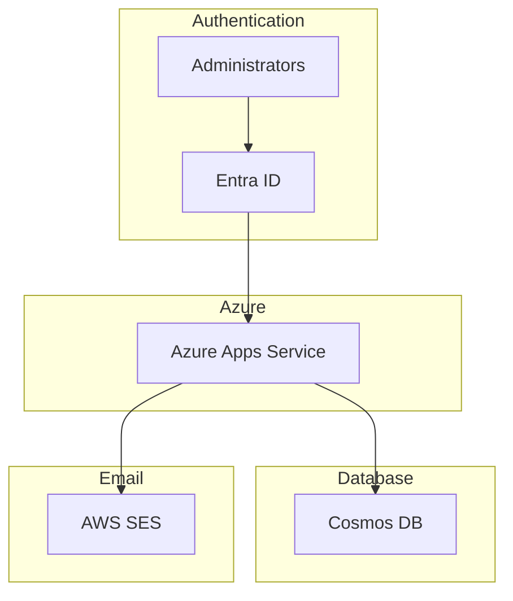

# Symbol Blockchain Emergency Announcement Email Distribution Application

## Overview
This application is an email management and distribution application for sending emergency announcements related to the Symbol blockchain. The system configuration ensures reliability and security using Azure, AWS, and Entra ID.

## System Diagram
Below is the system configuration diagram of this application.



## Feature Description
1. **Email Address Registration Form**:
   - Installed on our website, allowing users to register their email addresses.
   
2. **Distribution Management Screen**:
   - An authenticated user-only screen accessible only to administrators.
   - Create and distribute emergency announcement emails.

3. **Email Distribution**:
   - Use AWS SES (Simple Email Service) to distribute announcements to registered email addresses.

## Management and Operation
- **Authentication**:
  - Administrators are authenticated via Entra ID.
  - Only authenticated users can access the distribution management screen.

- **Operation**:
  - Operated by volunteer community members.

## Technologies Used
- **Azure Apps Service**: Application hosting
- **Cosmos DB**: Database management
- **AWS SES**: Email distribution service
- **Entra ID**: Authentication service

## Setup Instructions
1. **Clone the Repository**:
   ```bash
   git clone https://github.com/ymuichiro/symbol-community-mail-system
   cd symbol-community-mail-system
   ```

2. **Configure Azure App Service**:
   - Create a new app service in the Azure Portal and deploy the repository.

3. **Configure Cosmos DB**:
   - Create a Cosmos DB instance and obtain connection information.

4. **Configure AWS SES**:
   - Set up SES in the AWS Management Console and obtain the necessary credentials.

5. **Configure Entra ID**:
   - Set up administrator authentication and obtain the necessary credentials.

6. **Set Environment Variables**:
   - Create a `.env` file and set the following information.
     ```
    AWS_SES_SMTP_USER=
    AWS_SES_SMTP_PASSWORD=
    AWS_SES_SMTP_ENDPOINT=

    COSMOS_ENDPOINT=https://${name}.documents.azure.com:443
    COSMOS_KEY=
    COSMOS_DATABASE=MailAddress
    COSMOS_CONTAINER=Items

    # Azure AD OAuth2 Params
    # Callback URL Example: http://localhost:3000/api/auth/callback/azure-ad
    AZURE_AD_CLIENT_ID=
    AZURE_AD_CLIENT_SECRET=
    AZURE_AD_TENANT_ID=
    AZURE_AD_GROUP_ID=
    AUTH_SECRET=openssl rand -base64 128
    ```

7. **Start the Application**:
   ```bash
   npm install
   npm run dev
   ```

## Usage
1. **Email Address Registration**:
   - Access the registration form on the site and register your email address.

2. **Create Emergency Announcements**:
   - Log in to the management screen and create a new announcement.

3. **Email Distribution**:
   - Click the distribution button to send the announcement to registered email addresses.

## Contribution
- Please report bugs and propose features through GitHub Issues.
- Pull requests are welcome. Please refer to the detailed Contributing Guidelines.

## License
This project is released under the MIT License. For more details, please refer to the LICENSE file.

If you have any questions or suggestions regarding this document, please contact us at the above email address.